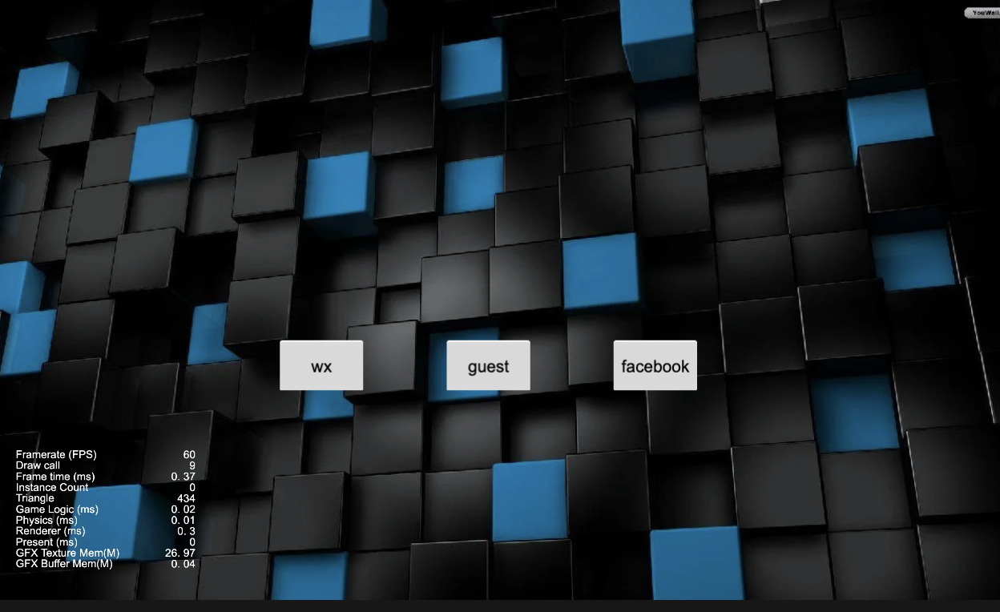
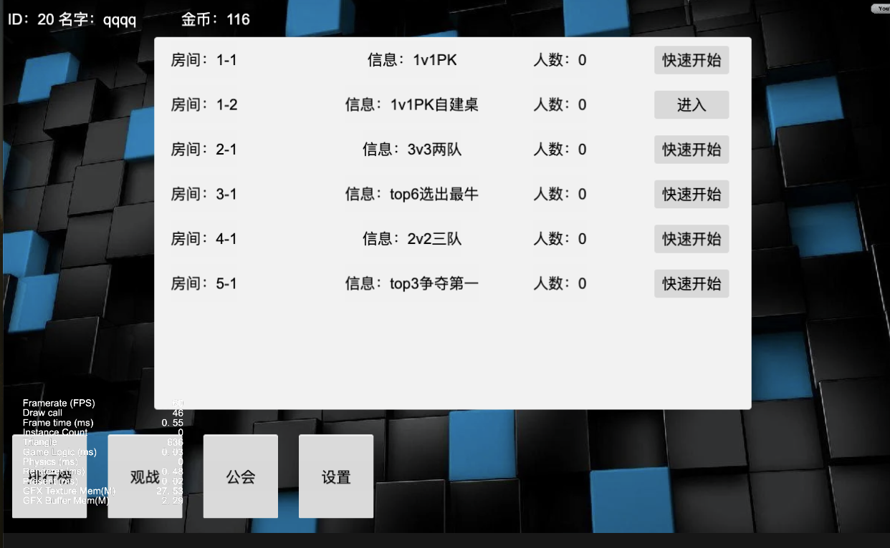
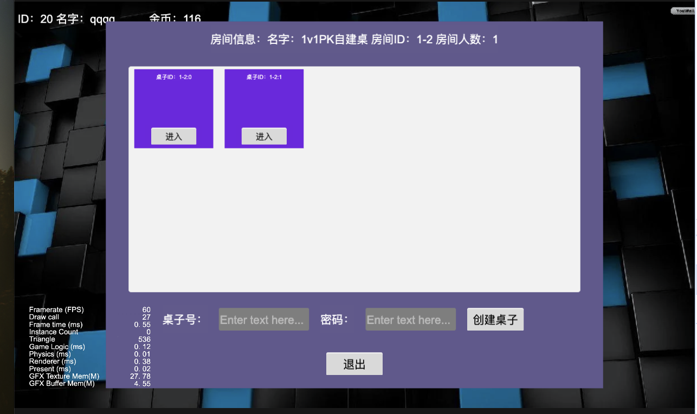
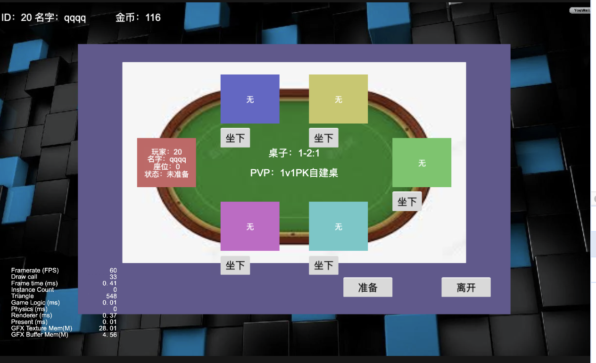
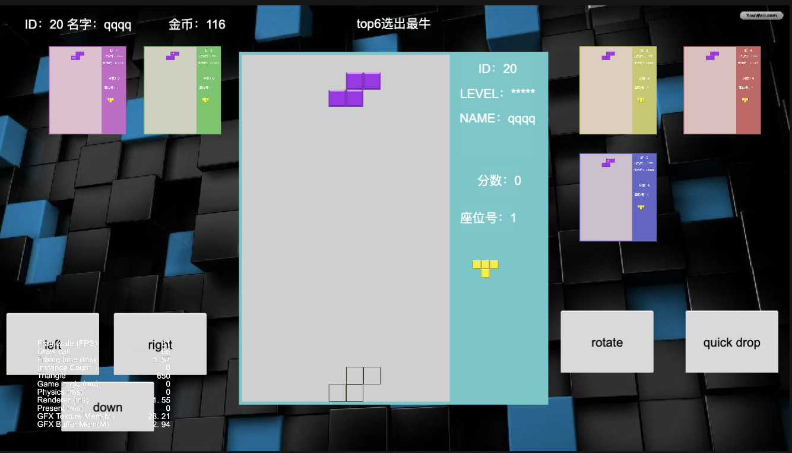
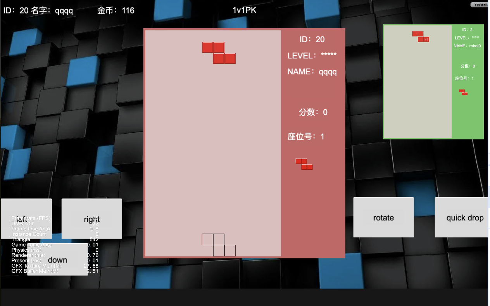
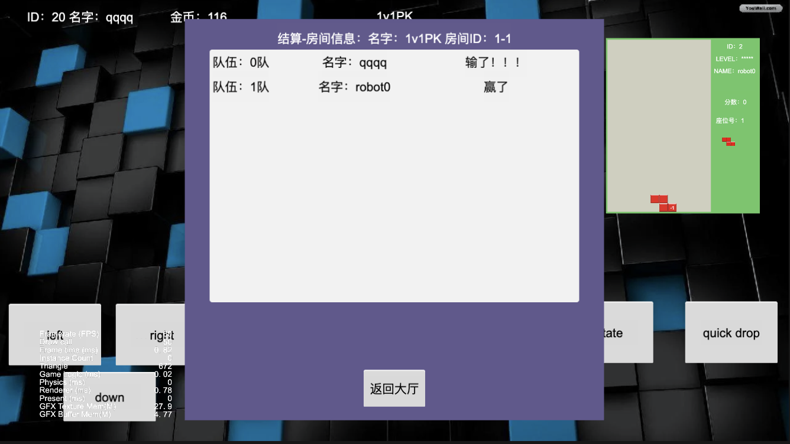

先贴图








介绍

```

不知道你们有没有玩过火拼俄罗斯方块？

1.可以发送道具，比如加一层，减一层，消三层，敌方加一层。
2.支持3v3，1v1，2v2三队，top6等玩法，支持组队。
3.todo：比赛玩法，微信拉好友一起玩。h5首页加载慢，无合图。

客户端cocos creator3.8
服务器golang

项目是帧同步，不过传输层用的是tcp，协议为websocket，如果想迁移到其它的协议，可以扩展mynano。
gate可以运行多种协议，供不同平台的客户端连接。

demo: http://110.40.133.37:3090/
```

git submodle使用

```
https://git-scm.com/book/zh/v2/Git-%E5%B7%A5%E5%85%B7-%E5%AD%90%E6%A8%A1%E5%9D%97
```

```
启动数据库mongo
version: "3"
services:
  master:
    image: mongo:5.0.0
    volumes:
      - ./data/:/data/db
      - ./tools/:/data/tools
    command: mongod --bind_ip_all
    ports:
      - 27017:27017

启动 docker-compose up -d
```

启动缓存redis

```angular2html
version: '2'
services:
  redis:
    image: redis
    container_name: redis
    ports:
      - "6379:6379"
    volumes:
      - ./data:/data

启动 docker-compose up -d
```

服务器配置

```angular2html
./server/bin/server.yaml
配置里包括数据库地址，房间配置，也可拆出
```

服务器创建机器人

```
go test -v io_test.go -args="1-1（房间） 2（人数） 1（模式）"
模式指的是快速匹配，还是自建桌
```

linux打包

```angular2html
./server/bin/build.sh
将生成的文件拷贝到目标服务器，运行之，也可放入docker
```

联系
```
457716947@qq.com
```
